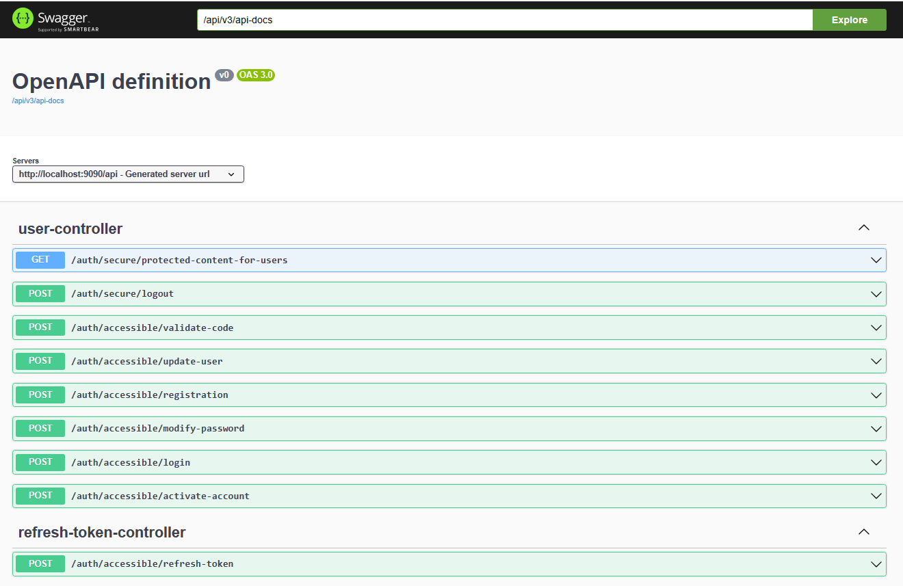

# Spring Boot Authentication Starter with Spring Security and JWT Token

This Spring Boot Authentication Starter provides a quick setup for implementing authentication in your Spring Boot applications using Spring Security and JWT (JSON Web Token) for secure communication between client and server.

### Specifications
- Spring Security Integration: Seamlessly integrates Spring Security for handling authentication and authorization.
JWT Token Authentication: Uses JWT tokens for secure authentication, preventing the need for sessions and storing tokens on the server.
- Customizable Configuration: Easily customize authentication and authorization rules to fit your application's requirements.
- Token Management: Includes utilities for token generation, validation, and expiration management.
- Sample Application: Provides a sample application demonstrating how to integrate and use the starter in your projects.


### Dependencies
```xml
    <dependency>
        <groupId>org.springframework.boot</groupId>
        <artifactId>spring-boot-starter-data-jpa</artifactId>
    </dependency>
```

```xml
    <dependency>
        <groupId>org.springframework.boot</groupId>
        <artifactId>spring-boot-starter-mail</artifactId>
    </dependency>
```


```xml
    <dependency>
        <groupId>org.springframework.boot</groupId>
        <artifactId>spring-boot-starter-security</artifactId>
    </dependency>
```

```xml
    <dependency>
        <groupId>org.springframework.boot</groupId>
        <artifactId>spring-boot-starter-web</artifactId>
    </dependency>
```

```xml
    <dependency>
        <groupId>org.postgresql</groupId>
        <artifactId>postgresql</artifactId>
        <scope>runtime</scope>
    </dependency>
```

```xml
    <dependency>
        <groupId>io.jsonwebtoken</groupId>
        <artifactId>jjwt-api</artifactId>
        <version>0.11.5</version>
    </dependency>
```

```xml
    <dependency>
        <groupId>io.jsonwebtoken</groupId>
        <artifactId>jjwt-impl</artifactId>
        <version>0.11.5</version>
    </dependency>
```

```xml
    <dependency>
        <groupId>io.jsonwebtoken</groupId>
        <artifactId>jjwt-jackson</artifactId>
        <version>0.11.5</version>
    </dependency>
```

```xml
    <dependency>
        <groupId>org.springdoc</groupId>
        <artifactId>springdoc-openapi-starter-webmvc-ui</artifactId>
        <version>2.2.0</version>
    </dependency>
```

### Functionalities
- Registration: By default the user has a USER role. When a user register an email containing a code is sent to the email. The user has to validate his account with the code sent. 
- Login: The user login using his email and his password. An access token and a refresh token are generated. The access token is used on the header of every request that requires authentication. And if the access token has expired, the user can request for another one using the refresh token. If the refresh token also has expired, the user is kicked out of his account.
- Update password

### Endpoints


